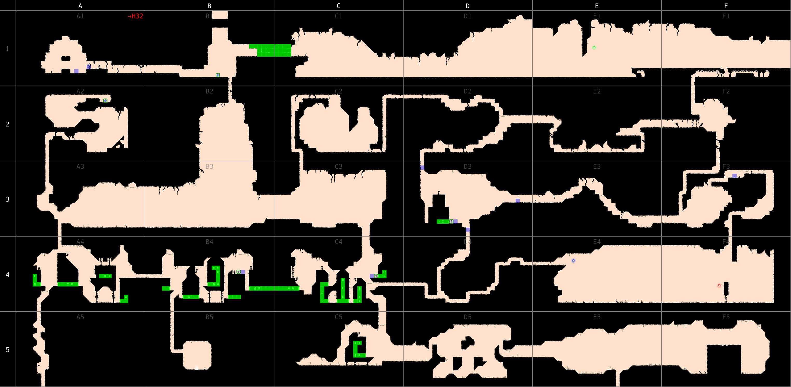
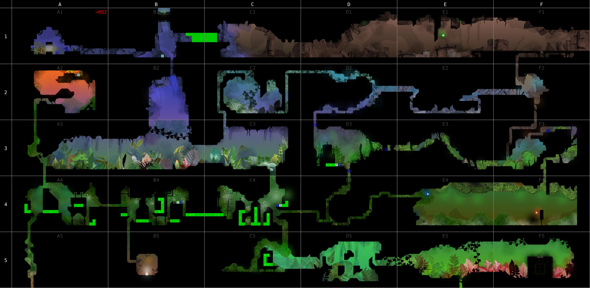

# Knytt Underground map generator

### Features

- Terrain
- Backgrounds
- Objects
- Secret passages
- Tiles
- Warp information

### Usage

The script requires git and Python 3.6. In the command line:

```console
git clone https://github.com/rr-/kug-mapper.git
cd kug-mapper
python3 -m kug_mapper --help
```

### Example

```console
python3 -m kug_mapper --scale 2 --geometry a1:f5 --output-path map1.jpg
```



```console
python3 -m kug_mapper --scale 2 --geometry a1:f5 --backgrounds-opacity 1 \
    --objects-opacity 1 --tiles-opacity 1 --output-path map2.jpg
```



Full maps are a little too big to store in a git repository.
